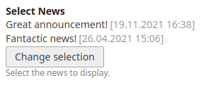
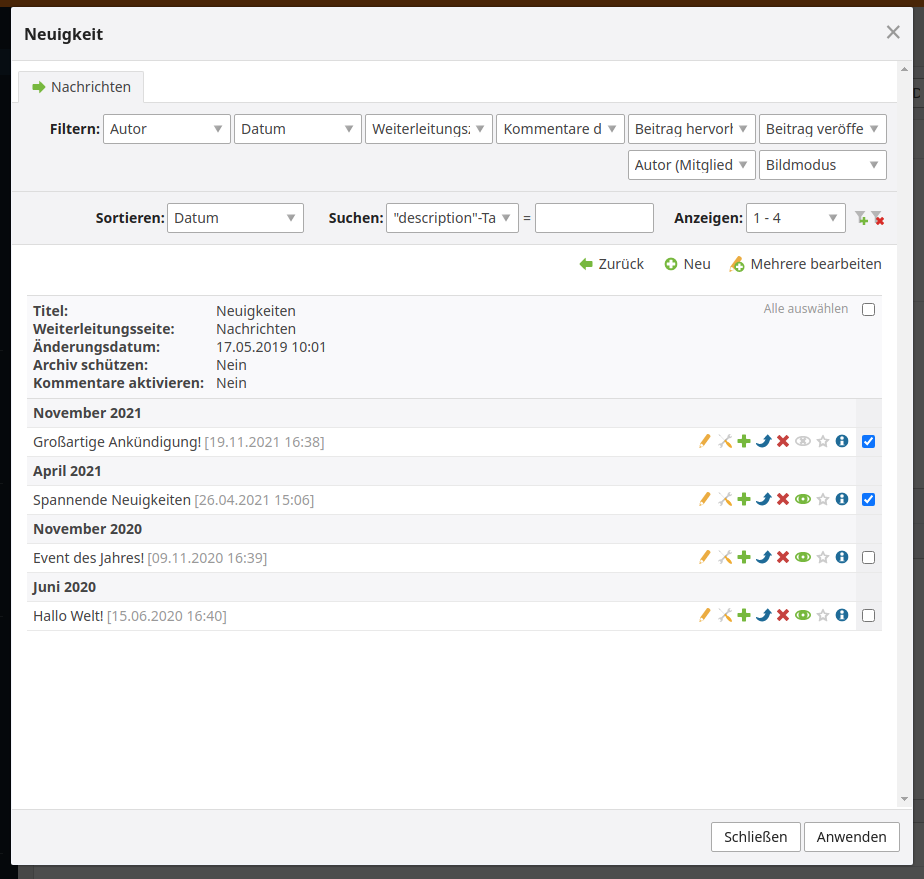

# Contao Newspicker Bundle

This bundle adds an newsPicker inputType to contao.





## Usage

### Setup

Install with composer or contao manager

### Usage in dca

```php
$GLOBALS['TL_DCA']['fields']['newsSelect'] = [
    'label'     => &$GLOBALS['TL_LANG']['tl_content']['newsSelect'],
    'inputType' => 'newsPicker',
    'eval'      => [
        'tl_class'  => 'clr',
        'multiple' => true,
    ],
    'sql'       => "blob NULL",
];
```


